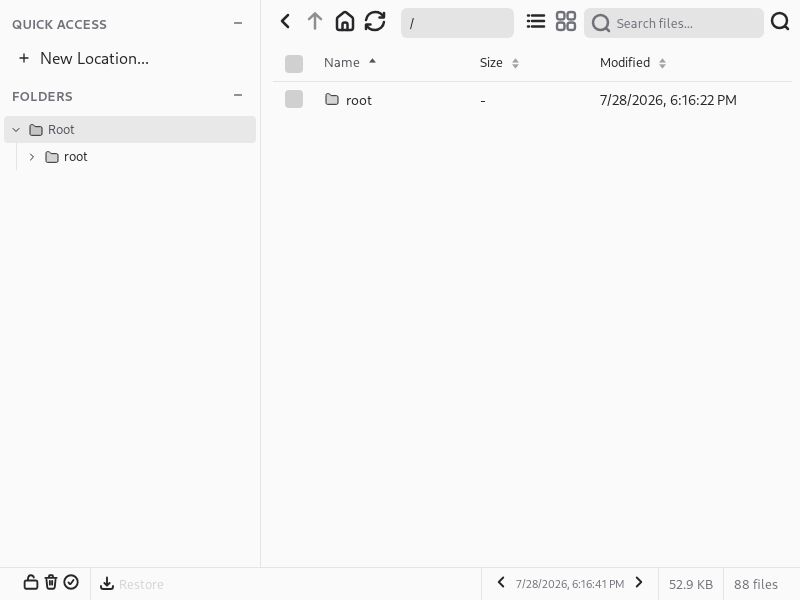
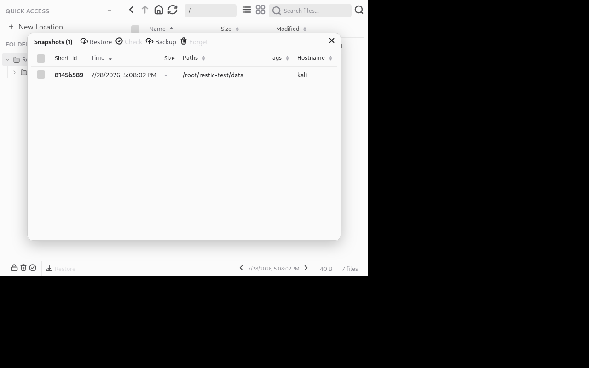
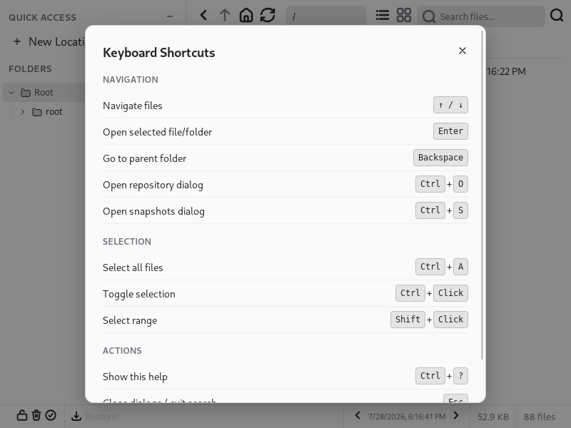

# Restic Browser

Cross-platform GUI for browsing and restoring [restic](https://github.com/restic/restic) backup repositories.

Built with [Tauri 2](https://tauri.app) + Lit + MobX + Vaadin. Fork of [emuell/restic-browser](https://github.com/emuell/restic-browser).

## Screenshots





## Features

- Browse snapshots and files in local and remote restic repositories
- Restore selected files or folders to a chosen location
- Open files by moving them to TEMP and launching the system default app
- Forget snapshots from the repository
- Sidebar with location presets, context menu, details pane, file icons
- rclone and WebDAV bridge support for remote locations

## Build from source

Everything is driven by the Makefile.

```bash
git clone https://github.com/fr33d0ck3r/restic-browser.git
cd restic-browser
make deps       # installs system packages, NVM+Node, Rust toolchain
make appimage   # produces bin/Restic-Browser-*.AppImage
```

For development:

```bash
make dev        # tauri dev server on http://localhost:1420
make build      # production build, binary in src-tauri/target/release/
make help       # list all targets
```

The `deps-system` target supports apt (Debian/Ubuntu), dnf (Fedora), and pacman (Arch). For anything else follow the [Tauri prerequisites](https://v2.tauri.app/start/prerequisites/).

## System requirements

**All platforms:** [restic](https://github.com/restic/restic/releases) in `$PATH`.

**Linux:** glibc 2.35+ (Ubuntu 22.04+), `libwebkit2gtk-4.1`. The AppImage bundles most dependencies.

**Windows:** Windows 10+ with [WebView2 Runtime](https://developer.microsoft.com/microsoft-edge/webview2/).

**macOS:** 10.13+.

## CLI arguments

```
Restic-Browser [OPTIONS]

-r, --repo <repo>                 repository (default: $RESTIC_REPOSITORY)
--repository-file <file>          file to read repository location from
--password <password>             repository password (NOT RECOMMENDED)
--password-file <file>            file to read repository password from
--password-command <command>      shell command to obtain repository password
--restic <path>                   path to restic executable
--rclone <path>                   path to rclone executable
--insecure-tls                    skip TLS verification
-v, --verbose                     verbose logging
-V, --version                     print version
-h, --help                        print help
```

Repository and password can also be set via environment variables. Restic Browser passes the full environment through to the restic binary, so any variable restic supports works here too:

```bash
RESTIC_REPOSITORY="s3:https://s3.example.com/bucket" \
RESTIC_PASSWORD="password" \
AWS_ACCESS_KEY_ID="key_id" \
AWS_SECRET_ACCESS_KEY="access_key" \
Restic-Browser
```

Supported backends and their credential variables:

| Backend | Prefix | Environment variables |
|---|---|---|
| Local | — | — |
| SFTP | `sftp:` | — |
| REST server | `rest:` | `RESTIC_REST_USERNAME`, `RESTIC_REST_PASSWORD` |
| rclone | `rclone:` | — |
| Amazon S3 | `s3:` | `AWS_ACCESS_KEY_ID`, `AWS_SECRET_ACCESS_KEY` |
| Azure Blob | `azure:` | `AZURE_ACCOUNT_NAME`, `AZURE_ACCOUNT_KEY` |
| Backblaze B2 | `b2:` | `B2_ACCOUNT_ID`, `B2_ACCOUNT_KEY` |
| Google Cloud | `gs:` | `GOOGLE_PROJECT_ID`, `GOOGLE_APPLICATION_CREDENTIALS` |
| WebDAV | `webdav:` | `WEBDAV_URL`, `WEBDAV_USERNAME`, `WEBDAV_PASSWORD` |

Other recognised variables: `RESTIC_REPOSITORY_FILE`, `RESTIC_PASSWORD_FILE`, `RESTIC_PASSWORD_COMMAND`, `RESTIC_INSECURE_TLS`.

## Keyboard shortcuts

- `Ctrl+O` — open repository dialog
- `Ctrl+S` — open snapshots dialog
- `Ctrl+?` — show keyboard help
- `Esc` — close dialogs
- `Arrows / PageUp / PageDown / Home / End` — navigate lists
- `Enter / Space` — open selected file or folder
- `Ctrl+A` — select all files

## License

MIT. See [LICENSE](./LICENSE).
